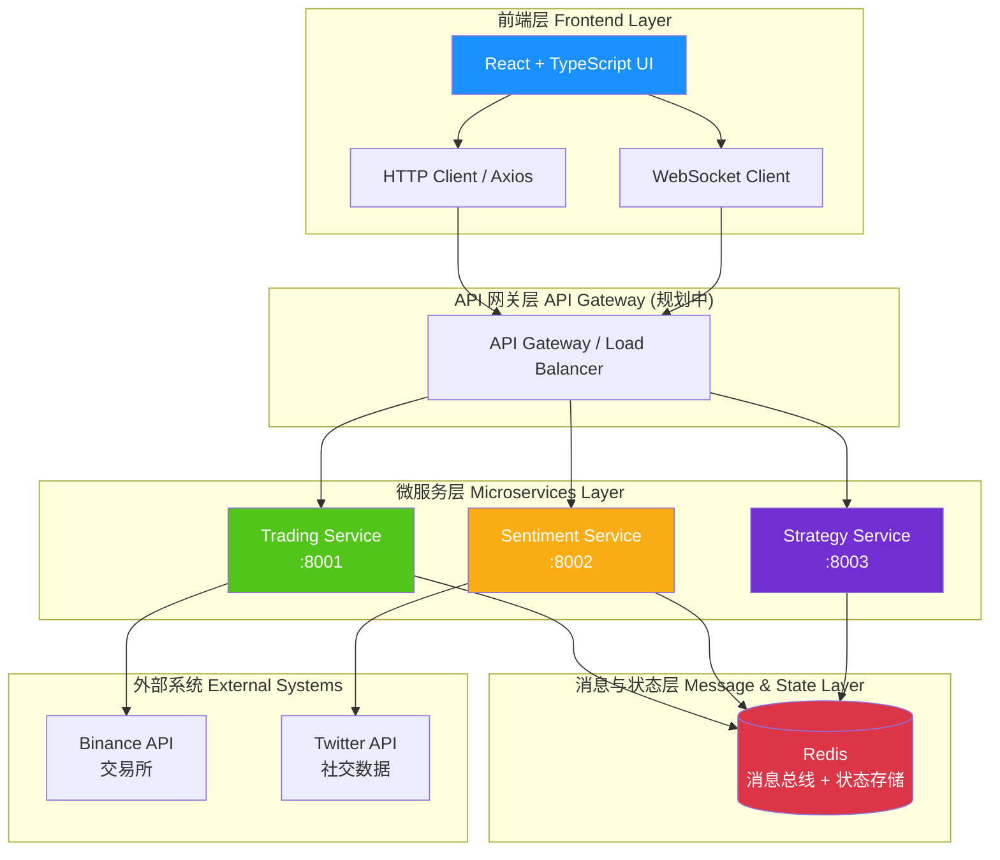
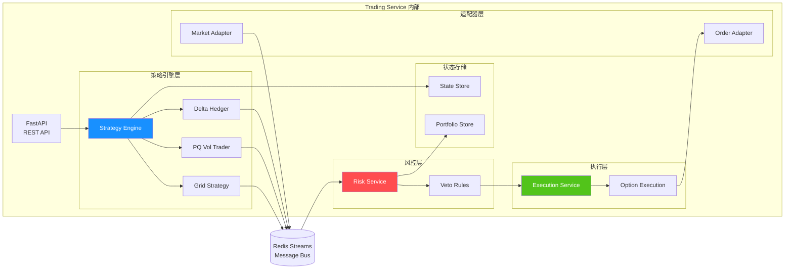
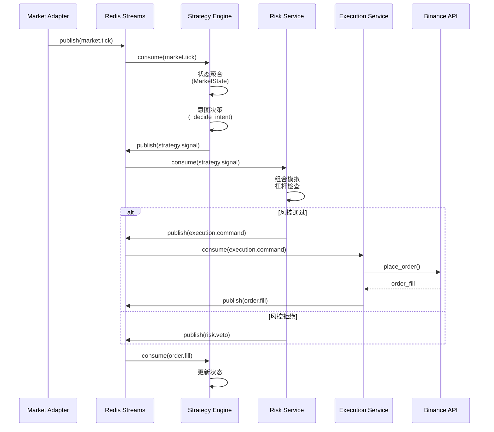
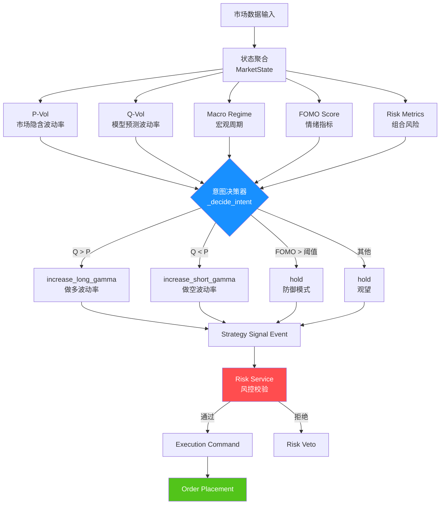
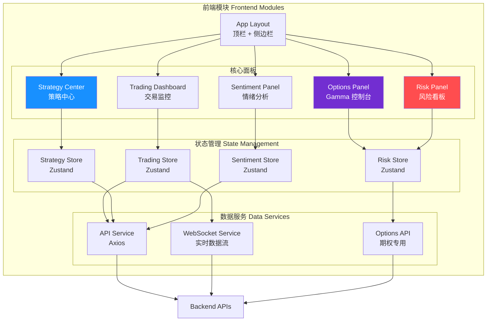
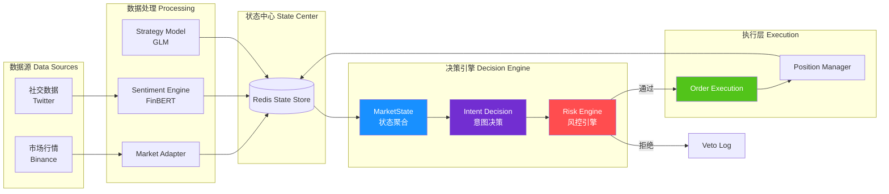
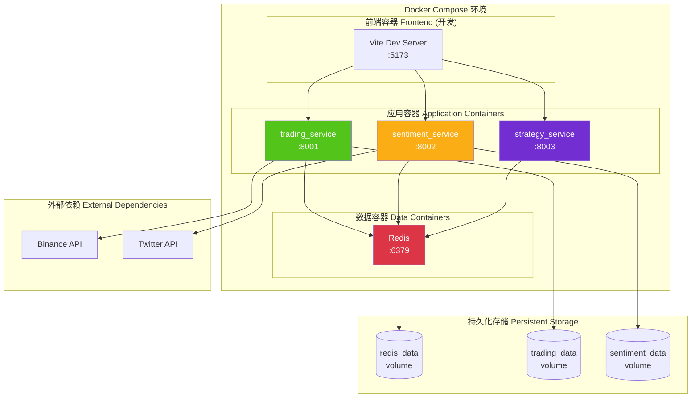
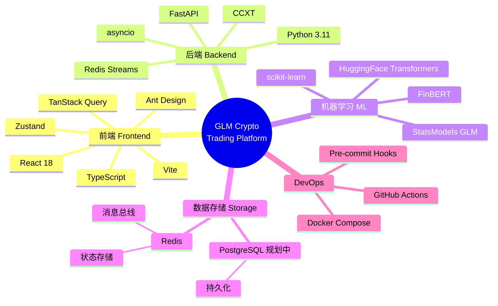

# GLM Crypto Trading Platform - 系统架构图

创建时间：2025-11-27 23:13:00

---

## 1. 总体架构图 (Overall Architecture)

---

## 2. Trading Service 内部架构

---

## 3. 事件驱动架构 (Event-Driven Architecture)

---

## 4. 策略意图架构 (Intent-Oriented Architecture)

---

## 5. 前端模块架构

---

## 6. 数据流图 (Data Flow Diagram)

---

## 7. 部署架构 (Deployment Architecture)

---

## 8. 技术栈总览

---

2025-11-27 23:13:00 - 系统架构图创建完成，包含 8 个核心视图
